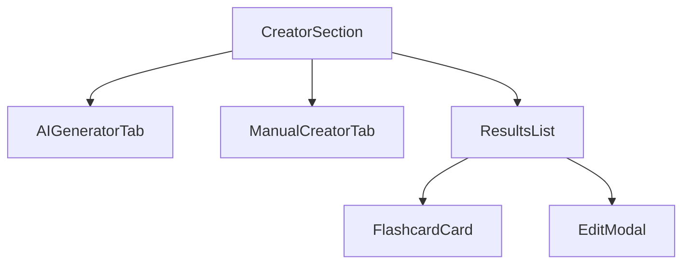

# Plan migracji interfejsu użytkownika

## Cel i uzasadnienie

### Cel
Celem tego planu jest przeprowadzenie migracji obecnej implementacji interfejsu użytkownika z podejścia opartego na stronach React do architektury Astro z wyspami React. Migracja ma na celu zachowanie identycznej funkcjonalności i wyglądu przy jednoczesnej optymalizacji wydajności i doświadczenia użytkownika.

### Uzasadnienie
Migracja do architektury Astro z wyspami React przyniesie następujące korzyści:

1. **Lepsza wydajność początkowego ładowania**
   - Mniejszy rozmiar JavaScript wysyłany do klienta
   - Szybsze renderowanie pierwszej treści (FCP)
   - Lepsze metryki Core Web Vitals

2. **Optymalizacja SEO**
   - Lepsze indeksowanie treści dzięki renderowaniu po stronie serwera
   - Szybsze ładowanie strony wpływające na ranking

3. **Lepsza skalowalność**
   - Łatwiejsze zarządzanie stanem aplikacji
   - Bardziej modularna architektura
   - Lepsze możliwości cache'owania

4. **Zgodność z najlepszymi praktykami**
   - Wykorzystanie zalet obu technologii (Astro i React)
   - Bardziej semantyczna struktura HTML
   - Lepsza dostępność (a11y)

### Ważne zasady implementacji
1. **Analiza istniejących komponentów**
   - Przed implementacją nowego komponentu, przeanalizować katalog `src/components`
   - Sprawdzić, czy nie istnieje już komponent o podobnej funkcjonalności
   - W przypadku znalezienia istniejącego komponentu:
     - Ocenić możliwość jego adaptacji do nowej architektury
     - Zidentyfikować wymagane modyfikacje
     - Przenieść i dostosować zamiast tworzyć od nowa
   - Unikać duplikacji kodu i funkcjonalności

## Analiza obecnej implementacji

### Główne komponenty React
1. **App.tsx** - Główny komponent aplikacji
   - Zarządza stanem autoryzacji
   - Renderuje odpowiednie sekcje (Creator, Preview, Learning)
   - Obsługuje routing między sekcjami

2. **WelcomeScreen.tsx** - Ekran powitalny
   - Obsługuje logowanie i rejestrację
   - Zawiera statyczną treść marketingową
   - Zarządza modalnymi oknami autoryzacji

3. **Sekcje aplikacji**
   - CreatorSection.tsx - Tworzenie i generowanie fiszek
   - PreviewSection.tsx - Przeglądanie i zarządzanie fiszkami
   - LearningSection.tsx - Sesje nauki

4. **Komponenty współdzielone**
   - NavigationBar.tsx - Nawigacja aplikacji
   - Modalne (LoginModal, RegisterModal, etc.)
   - Komponenty UI z shadcn/ui

### Analiza sekcji kreatora fiszek

#### Architektura komponentów
1. **CreatorSection.tsx** - Główny komponent zarządzający
   - Zarządza globalnym stanem sekcji
   - Obsługuje przełączanie między zakładkami (AI/Manual)
   - Integruje wszystkie podkomponenty
   - Implementuje logikę biznesową i obsługę błędów
   - Props:
     ```typescript
     interface CreatorSectionProps {
       generateFlashcards: (text: string) => Promise<FlashcardDto[]>;
       createFlashcard: (flashcard: FlashcardCreateDto) => Promise<FlashcardDto>;
       updateFlashcard: (id: string, flashcard: Partial<FlashcardDto>) => Promise<void>;
       deleteFlashcard: (id: string) => Promise<void>;
       acceptFlashcard: (id: string) => Promise<void>;
       discardFlashcard: (id: string) => Promise<void>;
       onLoadPage?: (page: number, limit?: number) => Promise<void>;
       onLoadCandidatesPage?: (page: number, limit?: number) => Promise<void>;
     }
     ```

2. **AIGeneratorTab.tsx** - Komponent generowania przez AI
   - Obsługa wprowadzania tekstu
   - Walidacja długości (1000-10000 znaków)
   - Wskaźnik postępu generowania
   - Integracja z API AI
   - Props:
     ```typescript
     interface AIGeneratorTabProps {
       onGenerate: (text: string) => Promise<void>;
       isGenerating: boolean;
     }
     ```

3. **ManualCreatorTab.tsx** - Komponent ręcznego tworzenia
   - Formularz z polami front/back
   - Walidacja pól
   - Liczniki znaków
   - Obsługa resetowania formularza
   - Props:
     ```typescript
     interface ManualCreatorTabProps {
       onAdd: (flashcard: FlashcardCreateDto) => Promise<void>;
       isAdding: boolean;
     }
     ```

4. **ResultsList.tsx** - Komponent listy wyników
   - Wyświetlanie utworzonych fiszek
   - Paginacja wyników
   - Integracja z komponentami modalnymi
   - Obsługa akcji (edycja, usuwanie, akceptacja)
   - Props:
     ```typescript
     interface ResultsListProps {
       flashcards: FlashcardDto[];
       pagination: PaginationDto;
       onEdit: (id: string, flashcard: Partial<FlashcardDto>) => Promise<void>;
       onDelete: (id: string) => Promise<void>;
       onAccept?: (id: string) => Promise<void>;
       onDiscard?: (id: string) => Promise<void>;
       onPageChange: (page: number) => Promise<void>;
       showTimeFilter?: boolean;
     }
     ```

#### Przepływ danych


#### Integracja z API
1. **Operacje na fiszkach**
   - Generowanie przez AI (`generateFlashcards`)
   - Tworzenie ręczne (`createFlashcard`)
   - Aktualizacja (`updateFlashcard`)
   - Usuwanie (`deleteFlashcard`)
   - Zarządzanie kandydatami (`acceptFlashcard`, `discardFlashcard`)

2. **Zarządzanie stanem**
   - Stan lokalny w CreatorSection:
     - `isLoading` - stan ładowania
     - `activeTab` - aktywna zakładka (ai/manual)
     - `lastGeneratedFlashcards` - ostatnio wygenerowane
     - `lastCreatedFlashcard` - ostatnio utworzone ręcznie

3. **Obsługa błędów**
   - System powiadomień (`showToast`)
   - Try-catch dla operacji API
   - Szczegółowe komunikaty błędów

#### Dostępność i UX
1. **Atrybuty ARIA**
   - Etykiety dla pól formularza
   - Role dla komponentów interaktywnych
   - Wskaźniki stanu ładowania

2. **Stylowanie**
   - Tailwind CSS
   - Komponenty shadcn/ui
   - Responsywny układ

#### Plan adaptacji do Astro

1. **Komponenty statyczne do przeniesienia**
   - Layout sekcji kreatora
   - Nagłówki i etykiety
   - Komunikaty o braku danych
   - Struktura zakładek

2. **Komponenty do zachowania jako wyspy React**
   - Formularze (AIGeneratorTab, ManualCreatorTab)
   - Lista wyników (ResultsList)
   - Modalne (EditModal)
   - Komponenty interaktywne shadcn/ui

3. **Optymalizacje**
   - Lazy loading dla zakładek
   - Opóźnione ładowanie komponentów modalnych
   - Optymalizacja ponownego renderowania
   - Strategia ładowania komponentów (client:idle, client:visible)

## Plan migracji

### Faza 1: Przygotowanie i konfiguracja

1. **Aktualizacja struktury projektu**
   ```
   src/
   ├── components/
   │   ├── react/        # Interaktywne komponenty React
   │   ├── astro/        # Komponenty Astro
   │   └── ui/           # Komponenty shadcn/ui
   ├── layouts/          # Layouty Astro
   ├── pages/           # Strony Astro
   └── middleware/      # Middleware Astro (istniejące)
   ```

2. **Konfiguracja routingu Astro**
   - Utworzenie podstawowych endpointów
   - Wykorzystanie istniejącego middleware do autoryzacji
   - Konfiguracja View Transitions API (już zaimplementowane w MainLayout.astro)

### Faza 2: Migracja komponentów statycznych

1. **Ekran powitalny**
   - Utworzenie `pages/index.astro`
   - Migracja treści marketingowej do komponentu Astro
   - Zachowanie interaktywnych elementów jako wysp React

2. **Layout aplikacji**
   - Wykorzystanie istniejącego `layouts/MainLayout.astro` jako bazowego layoutu
   - Rozszerzenie layoutu o dodatkowe komponenty nawigacyjne
   - Dostosowanie istniejących elementów UI do nowej struktury

3. **Komponenty pomocnicze**
   - Migracja statycznych komponentów UI do Astro
   - Optymalizacja obrazów i zasobów
   - Implementacja komponentów dostępności

### Faza 3: Migracja sekcji interaktywnych

1. **Sekcja Creator**
   ```astro
   ---
   // pages/creator.astro
   import { CreatorSection } from '../components/react/creator/CreatorSection';
   ---
   
   <Layout>
     <CreatorSection client:load />
   </Layout>
   ```

2. **Sekcja Preview**
   ```astro
   ---
   // pages/preview.astro
   import { PreviewSection } from '../components/react/preview/PreviewSection';
   ---
   
   <Layout>
     <PreviewSection client:load />
   </Layout>
   ```

3. **Sekcja Learning**
   ```astro
   ---
   // pages/learning.astro
   import { LearningSection } from '../components/react/learning/LearningSection';
   ---
   
   <Layout>
     <LearningSection client:load />
   </Layout>
   ```

### Faza 4: Optymalizacja stanu i autoryzacji

1. **Optymalizacja autoryzacji**
   - Wykorzystanie istniejącego middleware do weryfikacji sesji
   - Integracja AuthProvider z istniejącym systemem autoryzacji
   - Optymalizacja przekierowań dla niezalogowanych użytkowników

2. **Zarządzanie stanem**
   - Wykorzystanie localStorage do przechowywania tokenu
   - Implementacja hook'ów React do zarządzania stanem
   - Optymalizacja przepływu danych między komponentami

3. **Obsługa API**
   - Implementacja endpointów Astro
   - Optymalizacja zapytań do API
   - Implementacja cache'owania

### Faza 5: Optymalizacja wydajności

1. **Strategia ładowania komponentów**
   - Wykorzystanie `client:load` dla krytycznych komponentów
   - Wykorzystanie `client:visible` dla komponentów poniżej fold'u
   - Implementacja lazy loading dla modali i ciężkich komponentów

2. **Optymalizacja zasobów**
   - Implementacja optymalizacji obrazów Astro
   - Konfiguracja cache'owania statycznych zasobów
   - Minimalizacja bundle'a JavaScript

3. **Optymalizacja UX**
   - Implementacja View Transitions
   - Dodanie skeleton loaders
   - Optymalizacja Cumulative Layout Shift

## Kroki implementacji

### Krok 1: Analiza i przygotowanie
1. Przegląd istniejących komponentów w `src/components`
   - Katalogowanie komponentów do ponownego użycia
   - Identyfikacja wymaganych modyfikacji
   - Plan migracji dla każdego komponentu
2. Konfiguracja nowej struktury projektu
3. Dostosowanie istniejącego layoutu

### Krok 2: Ekran powitalny
1. Migracja statycznej treści do Astro
2. Implementacja modali autoryzacji jako wysp React
3. Testowanie flow logowania

### Krok 3: Sekcje aplikacji
1. Utworzenie stron Astro dla każdej sekcji
2. Migracja komponentów React
3. Implementacja nawigacji między sekcjami

### Krok 4: Autoryzacja i stan
1. Integracja z istniejącym middleware
2. Optymalizacja AuthProvider
3. Testowanie przepływu autoryzacji

### Krok 5: Optymalizacja i testy
1. Audyt wydajności
2. Implementacja optymalizacji
3. Testy end-to-end

## Wytyczne implementacyjne

### Komponenty React
- Najpierw sprawdzić istniejące komponenty w `src/components`
- Adaptować i przenosić istniejące komponenty zamiast tworzyć nowe
- Zachować istniejące propsy i interfejsy
- Dostosować do nowej architektury tylko w niezbędnym zakresie

### Komponenty Astro
- Wykorzystywać SSR dla statycznej treści
- Implementować optymalizacje obrazów
- Zachować istniejące style Tailwind

### Bezpieczeństwo
- Implementować middleware do autoryzacji
- Zabezpieczać endpointy API
- Walidować dane wejściowe

## Metryki sukcesu

1. **Wydajność**
   - Lighthouse score > 90
   - FCP < 1.5s
   - TTI < 3.5s

2. **Funkcjonalność**
   - Zachowanie wszystkich istniejących funkcji
   - Brak regresji w UX
   - Pełna zgodność z wymaganiami PRD

3. **Kod**
   - Brak błędów TypeScript
   - Zgodność z ESLint
   - Pokrycie testami > 80%

## Ryzyka i mitygacja

### Ryzyka
1. Problemy z zachowaniem stanu między komponentami
2. Regresje w funkcjonalności
3. Problemy z wydajnością przy dużej ilości danych

### Mitygacja
1. Dokładne testy integracyjne
2. Monitoring wydajności
3. Stopniowe wdrażanie zmian

## Harmonogram

1. **Tydzień 1**: Faza 1 i 2
   - Konfiguracja projektu
   - Migracja komponentów statycznych

2. **Tydzień 2**: Faza 3
   - Migracja sekcji interaktywnych
   - Implementacja routingu

3. **Tydzień 3**: Faza 4
   - Implementacja autoryzacji
   - Optymalizacja stanu

4. **Tydzień 4**: Faza 5
   - Optymalizacja wydajności
   - Testy i poprawki

## Podsumowanie

Plan migracji został zaprojektowany tak, aby:
1. Zachować istniejącą funkcjonalność
2. Poprawić wydajność aplikacji
3. Ułatwić przyszły rozwój
4. Zminimalizować ryzyko regresji

Implementacja będzie prowadzona iteracyjnie, z ciągłym monitorowaniem jakości i wydajności. Każda faza będzie testowana przed przejściem do kolejnej, co pozwoli na wczesne wykrycie i rozwiązanie potencjalnych problemów. 